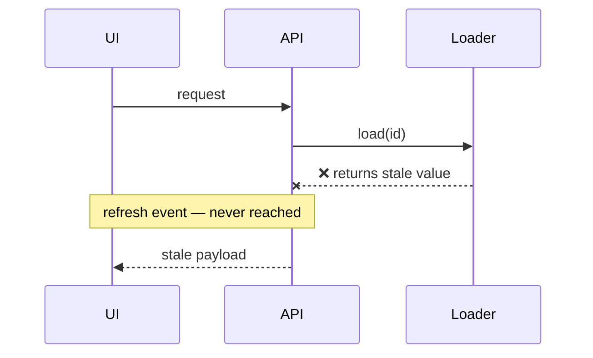

# RCA

Deliver an evidence-backed cause or an explicit unknown, then a resolution handoff — not a speculative fix. Separate observations, reported-but-unverified claims, inferences, and unknowns. Never manufacture certainty.

Investigate autonomously and persist until an honest conclusion state is supported or a specific blocker stops discrimination. Optimize for a trustworthy causal explanation, not for filling the document template or finding a merely plausible bug. Never invent evidence, identifiers, queries, code behavior, deploy state, or validation results.

## Access and scope

Inventory the evidence and tools actually mounted on this run before planning checks. The checks below are conditional, not a checklist. Never imply an unavailable check was performed. Retry a failed check only with a concrete reason; otherwise use an alternative or record the blocker.

The surface on this workstation:

- **Code** — the Akkio checkout at `~/repos/Akkio` (bare repo plus worktrees), read at a pinned revision through the shell. Cite repository + revision + `file:line`, never a branch name.
- **Linear and Datadog** — executor MCP Code Mode when it is mounted, `pup` for Datadog otherwise. Read [evidence-access.md](reference/evidence-access.md) before the first call.
- **SQL** — `/query-hz`, environment-matched. Read [data-layer.md](reference/data-layer.md) before writing a query.
- **UI reproduction** — `/web-browser`, and `/locating-request-origin` to resolve the real user surface.
- **Writeup** — Investigatr MDX in `~/repos/investigatr/main`, only when a writeup was asked for. Read [authoring.md](reference/authoring.md) before writing it.

Record the issue report's expected and actual behavior, user action, environment, services, timezone, user/tenant/resource/request/trace ids, raw error, and observed versus potential impact. Test the reporter's diagnosis rather than adopting it; first establish whether the behavior violates a real requirement.

Mark each evidence class available, partial, missing, or unknown. Missing access blocks dependent checks only — it does not block completion. The investigation is read-only: it authorizes no code changes, data writes, deployments, Linear edits, PRs, or fix implementation. The MDX writeup is the only write, and only on request. Investigation questions get chat answers.

## 1. Pin what ran

Recover the deployed revision **per relevant service** from request logs, deployment records, or build metadata; frontend, API, and worker versions can differ. Today's release is not incident evidence.

Application code lives in `~/repos/Akkio`: a bare repo plus one worktree per branch, with `~/repos/Akkio/master` on the default branch and `~/repos/Akkio/release-horizon-production` tracking `origin/release/horizon-production`. Take the environment from the issue report and read from the worktree tracking that environment's release branch:

```sh
wt list --format json                     # or: git -C ~/repos/Akkio worktree list
git -C <worktree> branch -vv              # confirm the tracked upstream
git -C <worktree> fetch --quiet
git -C <worktree> show <sha>:<path> | nl -ba
```

Confirm the upstream rather than trusting the directory name, and re-resolve the layout instead of assuming these paths persist. When no worktree tracks the environment's release branch — a staging worktree often does not exist — say so and either create one with `/manage-worktree` or fetch and read `origin/release/horizon-staging` directly (`git -C ~/repos/Akkio/master show origin/release/horizon-staging:<path>`). Never substitute a worktree on an unrelated branch.

Read the incident revision with `git show <sha>:<path>`, not the working tree: a checkout is a branch tip, and a branch tip is not evidence about the incident. Never pull, reset, or switch a worktree you do not own; fetch instead. If the incident revision cannot be resolved, name the exact revision you inspected and scope every conclusion to it. Fetch history before claiming a commit is absent.

## 2. Isolate the request and the attempts

Start from exact anchors — request id, trace id, session id, tenant — and widen only for a specific question. Resolve the real UI route and launch context from frontend evidence or persisted ids, not from backend names; `/locating-request-origin` owns that lookup. Fetch referenced payloads and stored artifacts yourself when authorized; a path does not establish its contents.

Build a timeline in UTC plus America/New_York (EST/EDT), and distinguish event time from ingestion time. For each retry, model, or job, record **attempt, input, execution result, render/persistence result, error, next action**. Never transfer evidence from a fallback attempt to an earlier one. Keep model output, backend error, and user-visible copy separate.

For multi-turn chat issues, find the first turn where bad state appeared; the reported or downvoted turn is often later. Classify suspicious values as user-supplied, context-supplied, carried from an earlier turn, or model-generated before calling anything a hallucination.

For any absence or count claim, retain the query, environment, window, searched fields, pagination state, and sampling or retention limits. Message-only searches miss attribute ids; zero matches do not prove absence. For frequency, aggregate before sampling.

## 3. Trace triggers and failure sites

Search error text, constants, exception constructors, and error-field assignments; follow wrappers and mappings. Separate **causal trigger → failure assignment → propagation → display**. Different triggers can reach the same assignment and emit an identical error, so a matching string is not an identification. Fill this in before concluding:

| Incident-revision site | Exact triggering condition | Evidence the condition held / didn't | Supported / rejected / unresolved |
| --- | --- | --- | --- |

Inspect `break`, `continue`, `return`, loop `else`, exception handlers, `finally`, awaited results, and state resets. Success at computation need not mean successful completion. Python `for/else` runs on exhaustion without `break`, not on an exception. Do not infer "the last item satisfies the predicate" from "some item does," and do not eliminate a site because it *ought* to require an exception.

Trace the active runtime path only after evidence localizes the layer.

## 4. Discriminate, then conclude

Write this compact check before establishing any cause:

**Hypothesis → supporting observations → necessary condition and the evidence it held → strongest viable competitor → distinguishing check with the predicted result under each → actual result → remaining unknowns.**

Choose the cheapest decisive check — payload, state, SQL, code, or reproduction. Relevant citations alone do not prove an inference. Seriously test attractive alternatives: model hallucination, bad source data, a recent deploy, malformed SQL, frontend payload loss, transient infrastructure.

Cross-check decisive claims with an independent evidence class — distinct provenance, or a different boundary in the causal chain. Multiple views, summaries, or copies derived from one event count as **one** class, not two.

For any check you claim to have executed, retain the command or query, the tested revision, the decisive assertion, and the output. Distinguish a check against application code from a simplified model that merely illustrates a hypothesis. Claim boundary coverage only when the input actually reached that boundary. Label isolated, integration, and live checks accurately.

On pushback, reopen the disputed inference: deployed code for branch or revision disputes, runtime inputs for state disputes. Do not re-read the same function — pull the actual runtime input. Results pasted by a human carry the same environment, time, and completeness limits as your own. Contradictions change the conclusion, not the framing.

## 5. Explain timing and impact

Inspect the introducing diff, not just blame on the line: old failure handling can become newly reachable without being touched. Separate merge time from deploy time, and inspect flags, config, data, and upstream changes when code alone does not explain onset. The same historical error text does not prove the same mechanism; before/after counts alone do not isolate causation. Accept a latent condition first being exercised — do not force every issue into a recent-deploy narrative.

Search the default and release branches for an existing fix or test. Verify inclusion in an affected release by ancestry **and** by reading the code, because cherry-picks diverge. Merged is not deployed.

Report scope on separate lines: observed instances, aggregate-query frequency, code-implied exposure, and unmeasured blast radius. Do not convert reachability into customer impact. Bound every count by its query, window, grouping, and retention; say earliest observed, never first ever. Rate mechanism, activation trigger, and impact separately — an unknown onset does not invalidate a proven mechanism, and it does not justify a fleet-wide impact claim.

## 6. Conclude, then hand off

Lead with the strongest proof: a reproduction, a revision diff, a query or state result, or quoted logs. Every causal claim needs both evidence and a valid inference; logs can prove a sequence without proving which branch failed.

Use the strongest honest stop state:

- **confirmed** — the exact artifact or a faithful reproduction, a demonstrated mechanism connecting cause to symptom, two agreeing evidence classes, and a deterministic reproduction, comparator, direct causal trace, or controlled intervention;
- **probable** — the mechanism is strongly supported but one report-specific link is unavailable; name the missing proof;
- **localized failure boundary** — where behavior diverges is proven, why is not; name the next discriminating check;
- **inconclusive** — required evidence is unavailable or conflicting; state exactly what is missing;
- **expected behavior / no defect** — prove the expectation mismatch without dismissing user impact;
- **blocked** — name the exact access, retention, environment, or reproduction blocker.

Assign confidence separately to symptom reproduction, mechanism, attribution to this reported occurrence, trigger or why-now, and blast radius. A confirmed generic defect does not prove it caused the reported occurrence. Never call a mechanism confirmed while a necessary check is open.

End with the **Resolution handoff**: the broken invariant; the owning revision, function, and condition; an acceptance check that includes a genuine-failure boundary where failures must still fail; verified existing fix, tests, and release status; and the open questions or next discriminating check. Insufficient evidence earns a next check, not a code proposal.

### When an intervention already happened

A fix, refresh, reload, config change, or deploy that already occurred is evidence, and evaluating it is diagnosis — not fix design. Before crediting it, state a falsifiable fix hypothesis: if the mechanism is correct, this intervention should produce a named observable change **while the original trigger remains present**. Replay the original workflow on the same surface, entity, request shape, and environment when safe; removing the trigger proves a workaround, not the mechanism. Treat absence of recurrence as supporting evidence only when the observation window and eligible traffic are known.

Record closure on separate dimensions — Intervention status: not started, implemented, or deployed/active. Mechanism validation: not tested, contradicted, supported, or validated. Original-surface validation: not attempted, blocked, failed, or passed. Overall closure: open, partially closed, closed, or reopened.

A merged pull request, completed deployment, refreshed cache, passing focused test, or Resolved issue status is not by itself proof that the original symptom is fixed. Full procedure: [fix-validation.md](reference/fix-validation.md).

**Do not design or propose a fix.** Diagnosis and fix design are separate requests. Name what is broken and what would prove a fix works; stop there. If the user asks for fix design in a later turn, load [fix-validation.md](reference/fix-validation.md).

## Evidence reduction

Reduce evidence where it is produced, not in your context. Aggregate and filter in the query, the Code Mode snippet, or the shell pipeline; return counts, distributions, chronology, selected fields, identifiers, and a few hypothesis-discriminating samples. Never pull a raw collection, complete API envelope, unbounded SQL result, or full log set into context. Preserve provenance for every reduced result: source, time range, query, total and matched counts, truncation state, and stable ids. Details and Code Mode specifics: [evidence-access.md](reference/evidence-access.md).

## Load only when needed

- Linear, Datadog, and code access: [evidence-access.md](reference/evidence-access.md) — read before the first evidence call.
- SQL, dbt, Snowflake, supplemental metadata, or audience cases: [data-layer.md](reference/data-layer.md) — read before writing a query.
- An intervention that already happened, or a separately requested fix design: [fix-validation.md](reference/fix-validation.md).
- Writing or updating the Investigatr MDX: [authoring.md](reference/authoring.md).
- Evaluating or changing this skill: [evaluation.md](reference/evaluation.md) — not extra work during an investigation.

## The writeup

Write the document after investigating, in reader-friendly order, and only when a writeup was requested. [authoring.md](reference/authoring.md) owns the repository location, frontmatter schema, and validation. Required sections, each present even when the answer is that an artifact is unavailable and why:

1. **TLDR** — the shortest defensible causal explanation and the conclusion state. This is the lede; do not precede it with a second abstract.
2. **Issue and scope** — the facts, not a summary: reported versus observed behavior, identifiers (request, trace, session, tenant, resource), environment and per-service revisions, and measured scope. A table reads better than prose. Mark important missing anchors Unknown rather than omitting the row.
3. **Timeline (ET)** — relevant chronology, including why the issue appeared when it did.
4. **Root cause** — the evidence-backed mechanism, alternatives ruled out, confidence by claim.
5. **How it broke — call path and failure flow** — see below.
6. **Reproduction and validation** — observed reproduction, comparators, and closed-loop checks, or a precise reason they were unavailable.
7. **Resolution handoff** — broken invariant, owning code and condition, acceptance check with a genuine-failure boundary, existing fix and release status, next discriminating check. Not a patch proposal.
8. **Residual gaps / next evidence** — unknowns, blockers, and the next discriminating check.

Cite evidence inline, at the claim it supports.

### How it broke — call path and failure flow

Open with a short plain-language paragraph: what the user did, what the system tried, where it broke, and why that produced the symptom. Write it for a junior engineer, define unfamiliar platform concepts, and keep the causal link intact — this replaces a separate ELI5 section, so it must carry that weight rather than being a caption. Then make the chain concrete enough to follow bad state from entry point to symptom:

- One Mermaid sequence diagram or flowchart (the Investigatr site renders them). Mark the first bad boundary with `❌` and label skipped downstream operations `never reached`.
- A textual call graph using real symbols with `path:line@commit` references.
- At the responsible boundary, state the input, the expected output, and the actual output.
- Continue through propagation to the user-visible symptom. Do not stop at the suspicious function.
- Include the component or state tree only when frontend state or rendering is causal.



```text
Page.load → api.get → Loader.load ❌ → response.serialize → Widget.render
```

For a data-only issue, expected behavior, configuration problem, external dependency failure, or blocked investigation, do not invent a diagram, symbol, or line reference. Show the observed data and control boundaries instead, and say which code artifacts are unavailable and why.

Before submitting, ask: **could a junior engineer point to the first bad boundary, explain how the symptom propagated, and name the file and function that owns the durable fix?** If not, improve the explanation or document why the missing evidence prevents it.

Before finalizing, verify: incident revisions pinned and honestly qualified; exact trigger and failure assignment separated; the competing check written down; attempts kept separate; negative evidence and impact qualified; confidence consistent with open checks; a handoff that is actionable and proposes no patch. No invented facts.
